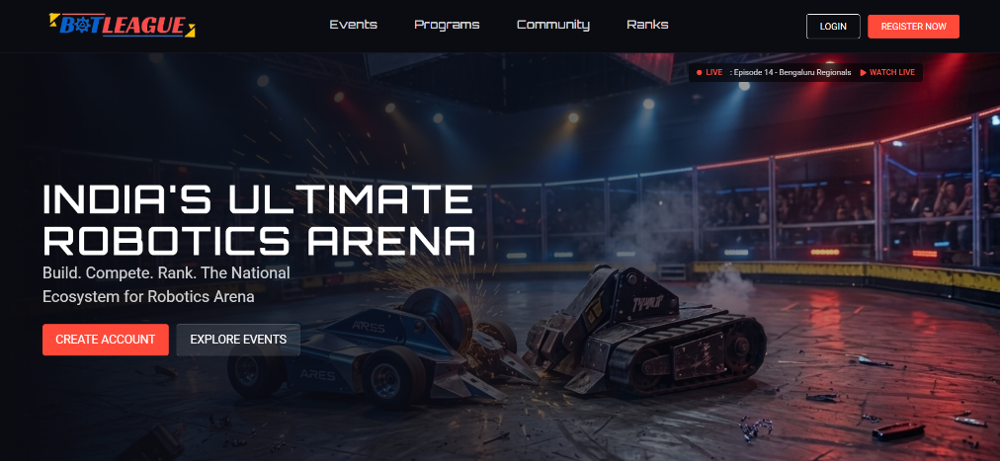

# BotLeague

A responsive, client-side single-page website for the BotLeague robotics tournament platform, built using React, TypeScript, and Vite. This project implements a high-fidelity frontend layout based on a Figma design.

[](https://react.dev)
[](https://www.typescriptlang.org)
[](https://vite.dev)
[](https://tailwindcss.com)
[](https://tanstack.com/router)
[](https://opensource.org/licenses/MIT)

## Overview

This project is a frontend implementation of the BotLeague robotics tournament portal, developed for a Frontend Developer Internship. The portal serves as a hub for robotics tournaments, rankings, and registrations across India. It converts a design mockup into a structured, responsive component-based React application using Tailwind CSS for styling and TanStack Router for file-based client-side routing.

## Features

- **Interactive Tournament Bracket**: Scalable inline SVG diagram showing match progression for ongoing regionals (e.g., Bengaluru Regionals).
- **Responsive Single-Page Layout**: High-fidelity implementation of the Figma layout, optimized across mobile, tablet, and desktop viewports.
- **Client-Side Routing**: File-based type-safe routing powered by TanStack Router.
- **Dynamic Feedback & Notification Systems**: Context-aware toast notifications using `sonner` for newsletter sign-ups and authentication flows.
- **Simulator Auth Forms**: Full UI for authentication (Login & Registration) with active state handling and basic form validation.

## Tech Stack

| Technology | Description | Version |
| :--- | :--- | :--- |
| **React** | Component-based UI library | 19.2.0 |
| **TypeScript** | Type-safe JavaScript extension | 5.8.3 |
| **Vite** | Frontend tooling and local dev server | 8.0.16 |
| **Tailwind CSS** | Utility-first styling framework | 4.2.1 |
| **TanStack Router** | File-based type-safe router | 1.170.16 |
| **Lucide React** | Consistent SVG icons pack | 0.575.0 |
| **Sonner** | Accessible toast notification library | 2.0.7 |

## Folder Structure

<details>
<summary>View Folder Structure</summary>

```text
Assignment/
├── index.html                  # HTML entry point and global font configurations
├── package.json                # Project scripts and package dependencies
├── tsconfig.json               # TypeScript path alias and module resolution configurations
├── vite.config.ts              # Vite plugins and configuration settings
├── eslint.config.js            # Linter rules and stylistic enforcement
├── src/
│   ├── main.tsx                # Application mounting entry point
│   ├── router.tsx              # Router instantiation context
│   ├── routeTree.gen.ts        # Generated TanStack Route tree
│   ├── styles.css              # Stylesheet with Tailwind v4 imports and theme variables
│   ├── assets/
│   │   └── images/             # Extracted visual assets (logos, event illustrations, sponsors)
│   ├── components/
│   │   ├── layout/             # App shell components (Navbar, Footer)
│   │   ├── sections/           # Modular page-specific content blocks
│   │   └── ui/                 # Reusable ui components (Sonner configurations)
│   ├── data/
│   │   └── sectionsData.ts     # Data-driven static configs (Journey paths, partners, disciplines)
│   ├── lib/
│   │   └── utils.ts            # Helper function for conditional class merging
│   └── routes/                 # File-based routing pages (Home, Events, Programs, Community, Login, Register)
```

</details>

## Getting Started

### Installation

Clone the repository:

```bash
git clone https://github.com/RashikaLahoti/BotLeague.git
cd BotLeague
```

Install dependencies using `npm`:

```bash
npm install
```

Start the local development server:

```bash
npm run dev
```

## Build for Production

Compile and bundle the production assets:

```bash
npm run build
```

The output bundle will be generated in the `dist/` directory.

## Screenshots



## Deployment

- **Live Demo**: [Live Demo Placeholder Link](https://bot-league-puce.vercel.app/)
- **GitHub Repository**: [https://github.com/RashikaLahoti/BotLeague](https://github.com/RashikaLahoti/BotLeague)

## License

This project is licensed under the MIT License.

## Author

- **Name** - [GitHub](https://github.com/RashikaLahoti) | [LinkedIn](https://www.linkedin.com/in/rashika-lahoti-3236a228b/)
